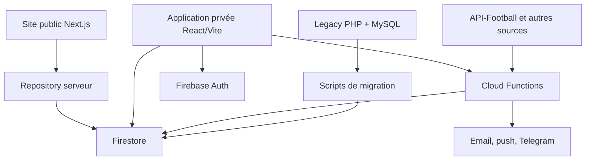
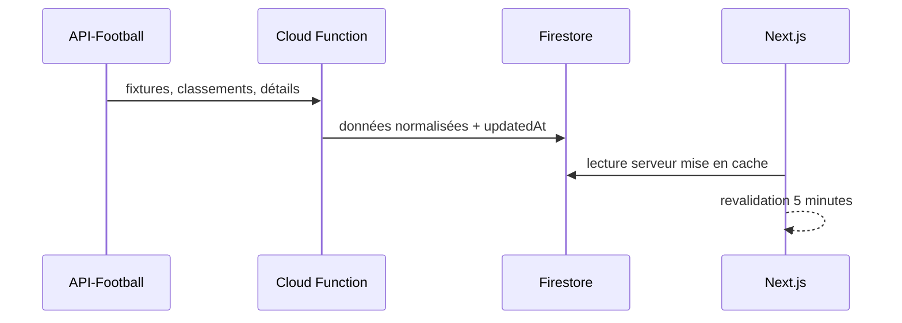

# Architecture actuelle — Prono-L1

> **Statut :** architecture de référence au 28 août 2026  
> **Portée :** dépôt `ailidmx/pronoL1` après la fusion de la PR #40  
> **Objectif :** décrire ce qui existe réellement, fixer les frontières entre applications et guider les prochains changements structurels.

Les documents spécialisés restent valables :

- [Plan de réarchitecture](./rearchitecture-plan.md) : migration du legacy vers Firebase ;
- [Architecture de croissance publique](./public-growth-architecture.md) : règles SEO, monétisation et expérimentation ;
- [Plan multi-compétitions](./public-multi-competition-plan.md) : extension des données et règles de publication.

Ce document est la vue d'ensemble canonique. Il doit évoluer lorsqu'une frontière, un flux ou une décision structurante change.

## 1. Résumé exécutif

Prono-L1 est aujourd'hui un dépôt de transition comportant trois produits :

1. **l'application legacy** PHP/MySQL, encore conservée comme référence fonctionnelle et solution de repli ;
2. **l'application privée** React/Vite, authentifiée avec Firebase Auth, pour les pronostics, bonus, quiz, profil et classements joueurs ;
3. **l'application publique Stat de Foot** Next.js, orientée SEO, acquisition, PWA et freemium.

Firestore est le centre de données du nouveau système. Des Cloud Functions synchronisent les données football, appliquent les règles métier sensibles et matérialisent certains modèles de lecture. Le dossier `shared/` porte la validation et les calculs purs utilisables côté backend ou dans les tests.

La direction générale est saine. Le principal risque structurel n'est plus le choix de stack, mais la croissance parallèle de deux frontends et de plusieurs formes de logique métier sans contrats de module suffisamment explicites.

## 2. Contexte système



### Principes de frontière

- `public-web/` et `web/` sont deux applications indépendantes ; elles ne doivent pas être fusionnées.
- Le navigateur public ne doit pas accéder directement à Firestore avec des privilèges serveur.
- Toute écriture métier sensible passe par une Cloud Function : verrouillage avant coup d'envoi, contrôle des deadlines, scoring et droits.
- Les calculs déterministes et validations doivent vivre dans `shared/`, sans dépendance Firebase ou React.
- Le legacy reste isolé ; aucun nouveau domaine ne doit y être développé sauf correctif nécessaire à la continuité.
- Les scripts sont des opérations contrôlées, pas une API applicative.

## 3. Cartographie du dépôt

| Zone | Responsabilité | Stack | Statut |
|---|---|---|---|
| `api/`, `index.php`, `app.js`, `style.css` | Produit historique complet | PHP, MySQL, JavaScript | Maintenu comme fallback |
| `web/` | Produit privé authentifié | React 19, Vite, Firebase client | Migration active |
| `public-web/` | Produit public indexable et installable | Next.js 16, React 19, TypeScript | Croissance active |
| `functions/` | Commandes métier, synchronisations et tâches planifiées | Cloud Functions v2, Node 22 | Backend cible |
| `shared/` | Domaine pur, validation, scoring, payloads et chemins | JavaScript ESM, Node test runner | Noyau partagé |
| `scripts/` | Imports, normalisation, seeds et backfills | Node.js, Admin SDK | Opérations ponctuelles |
| `firestore.rules` | Contrôle des accès clients | Firestore Rules | Deny-by-default |
| `.github/workflows/` | Validation et déploiement | GitHub Actions | CI/CD actif |
| `docs/` | Décisions, plans et contrats | Markdown | Documentation vivante |

## 4. Applications et responsabilités

### 4.1 Application privée — `web/`

Responsabilités actuelles :

- inscription et connexion email/mot de passe ;
- connexion Google et réinitialisation du mot de passe ;
- profil joueur et équipe de cœur ;
- saisie des pronostics avant le coup d'envoi ;
- bonus de fin de saison ;
- quiz hebdomadaire ;
- classement des pronostiqueurs.

Le frontend peut lire les données autorisées par les règles Firestore. Il appelle les fonctions pour les écritures dont la validité dépend de l'identité, du temps ou d'autres documents.

**Direction structurelle cible :**

```
UI/pages → hooks/use-cases → services Firebase → Cloud Functions / Firestore
```

Les composants React ne doivent pas contenir de règles de scoring, de contrôle de deadline ni de construction libre de payloads.

### 4.2 Application publique — `public-web/`

Responsabilités actuelles :

- pages serveur de saison, journée, match et club ;
- résultats, calendrier, classements général/domicile/extérieur ;
- détails de match : événements, compositions et statistiques si disponibles ;
- SEO technique, données structurées, sitemap et fraîcheur ;
- PWA installable avec fallback hors ligne explicite ;
- favoris et historique locaux ;
- analyses calculées avec quota anonyme ;
- politiques de monétisation et emplacements publicitaires ;
- passerelle vers l'application privée.

Les pages sportives privilégient la fraîcheur. Le service worker ne doit jamais transformer des données sportives anciennes en vérité courante. Le cache applicatif Next.js est actuellement revalidé toutes les cinq minutes dans le repository serveur.

Les fonctions de stockage local sont une commodité anonyme, pas un compte. La synchronisation multi-appareil devra être introduite derrière une abstraction d'identité et de persistance, sans réécrire les pages.

### 4.3 Backend — `functions/`

Fonctions actuelles :

- profil : `getProfile`, `saveProfile` ;
- pronostics : `savePronostic` ;
- bonus : `saveBonusAnswer` ;
- quiz : `saveQuizAnswer` ;
- scoring : `scoreFinishedMatches` toutes les quinze minutes ;
- données football : synchronisations générales, fixtures et détails récents ;
- diagnostic : `health`.

Le backend utilise l'Admin SDK. Les règles Firestore ne protègent donc pas les fonctions : chaque fonction doit vérifier explicitement authentification, autorisation, schéma, deadline et existence des références.

### 4.4 Domaine partagé — `shared/`

Le domaine partagé contient les règles pures :

- validation et construction de payloads ;
- règles de pronostic ;
- calcul du barème ;
- classement et rang partagé ;
- profils ;
- bonus ;
- quiz ;
- noms et chemins de collections.

Une unité de domaine partagée doit rester :

- déterministe ;
- testable sans Firebase ;
- sans accès réseau ;
- sans dépendance React ;
- compatible avec le runtime Node ciblé.

## 5. Flux principaux

### 5.1 Synchronisation football



Les identifiants stables sont les identifiants API-Football :

- club : `apfId` ;
- match : `apfFixtureId` ;
- saison métier : année de début, par exemple `2026`.

Le modèle multi-compétitions prévu doit ajouter `competitionId` à toutes les clés qui ne sont pas globalement uniques.

### 5.2 Saisie et scoring d'un pronostic

1. L'utilisateur authentifié saisit un score dans `web/`.
2. `savePronostic` vérifie l'identité, le schéma et le statut du match.
3. La fonction écrit dans `matches/{matchId}/pronostics/{uid}`.
4. Après la fin du match, `scoreFinishedMatches` calcule les points.
5. Le résultat détaillé est écrit sur le pronostic.
6. Le read model `leaderboardPronostics/{seasonId}/rows/{uid}` est mis à jour.
7. Le client trie les lignes et calcule le rang partagé.

Limitation connue : un match déjà scoré n'est pas recalculé si son score final est corrigé.

### 5.3 Bonus et quiz

Les réponses passent par des fonctions callable. Les clients peuvent lire la configuration publiée et leurs propres réponses ; ils ne peuvent pas écrire directement. Le seed bonus est idempotent et automatisé. Le seed quiz dépend du dump SQL gitignoré et reste une migration manuelle.

### 5.4 Déploiement

Sur chaque PR, la CI valide séparément :

- `web/` : lint et build ;
- `functions/` : bundle ;
- `public-web/` : lint, typecheck, tests et build ;
- `shared/` : tests Node.

Après fusion sur `main`, le workflow de déploiement construit et déploie Firestore, Functions et Firebase Hosting pour l'application privée. Le site public possède un cycle Firebase App Hosting distinct.

## 6. Modèle de données principal

| Collection | Nature | Écrivain principal | Lecteurs |
|---|---|---|---|
| `users/{uid}` | profil et préférences | Functions / utilisateur contrôlé | propriétaire, admin |
| `clubs/{apfId}` | référentiel clubs | synchronisation/admin | privé et public serveur |
| `seasons/{id}` | saisons | synchronisation/admin | privé et public serveur |
| `matches/{apfFixtureId}` | match et détails | synchronisation/admin | privé et public serveur |
| `matches/{id}/pronostics/{uid}` | commande utilisateur enrichie par scoring | Functions | utilisateurs authentifiés |
| `standings/{season_mode}` | read model équipe | synchronisation/admin | privé et public serveur |
| `leaderboardPronostics/{season}/rows/{uid}` | read model joueurs | scoring | utilisateurs authentifiés |
| `bonus/{season}/questions/{id}` | configuration | seed/admin | authentifiés |
| `bonus/{season}/answers/{uid}` | réponses | Functions | propriétaire, admin |
| `quizWeeks/{week}/...` | quiz et réponses | seed, admin, Functions | selon sous-collection |
| `syncRuns/{job_competition}` | observabilité prévue | synchronisations | admin/ops |

Deux vocabulaires coexistent encore dans la documentation et le code : `seasons`/`saisons`, identifiants legacy et identifiants API-Football. Toute nouvelle écriture doit utiliser les identifiants normalisés et documenter explicitement les migrations restantes.

## 7. État des changements récents

Les PR #21 à #40 ont fortement accéléré la migration :

- normalisation des clubs et matchs autour des identifiants API-Football ;
- application privée enrichie avec pronostics, scoring, classement, profil, bonus et quiz ;
- authentification Google et récupération de mot de passe ;
- corrections du pipeline de seed et séparation entre données automatisables et dump contenant des données personnelles ;
- site public relié correctement à l'application privée ;
- stockage local pour favoris, historique et quota d'analyse ;
- analyse de match déterministe sans IA ;
- PWA publique durcie pour la fraîcheur, l'installation et la navigation mobile.

Cette progression est cohérente fonctionnellement, mais plusieurs features ont été ajoutées plus vite que les couches frontend prévues dans le plan initial.

## 8. Risques et dette structurelle

### Priorité haute

1. **Architecture frontend privée encore plate.** Les fichiers de pages et l'accès Firebase risquent de devenir un nouveau monolithe React. Il faut introduire les couches par domaine avant d'ajouter groupes privés, notifications ou administration.
2. **Contrats de données dispersés.** Les types TypeScript du site public, les validateurs JavaScript partagés et les documents Firestore peuvent diverger.
3. **Scoring non réentrant.** Une correction de score final ne recalcule pas proprement le delta du classement.
4. **Observabilité de synchronisation incomplète.** Le plan prévoit `syncRuns`, mais il faut en faire un contrat réel avant le multi-compétitions.

### Priorité moyenne

5. **Deux applications, deux systèmes UI.** Le partage direct de composants React est risqué entre Vite et Next.js ; partager d'abord tokens, domaine et contenu.
6. **Nommage saison/compétition.** Le passage multi-compétitions exige une clé canonique avant d'ingérer une deuxième ligue.
7. **Tests backend limités au domaine pur.** Les fonctions et règles Firestore ont besoin de tests d'intégration avec émulateurs.
8. **LocalStorage public.** Favoris, historique et quotas sont contournables et non synchronisés ; acceptable pour l'anonyme, insuffisant pour un vrai compte gratuit.
9. **Legacy encore source implicite de vérité.** Il faut une matrice de parité explicite pour savoir ce qui bloque sa mise en lecture seule puis son retrait.

## 9. Ordre structurel recommandé

### Étape 1 — figer les contrats de domaine et de données

Créer un contrat canonique pour :

- identifiants `competitionId`, `seasonId`, `clubId`, `matchId` ;
- statuts de match ;
- structures Firestore ;
- payloads et erreurs des fonctions ;
- règles de publication du site public.

Le minimum pragmatique est un package `shared/` clairement découpé par domaine, accompagné de tests et, lorsque nécessaire, de types TypeScript générés ou vérifiés.

### Étape 2 — réorganiser `web/` par domaines

Structure cible proposée :

```
web/src/
  app/
  domains/
    auth/
    profile/
    pronostics/
    bonus/
    quiz/
    leaderboard/
  shared/
    ui/
    firebase/
    hooks/
    content/
```

Chaque domaine possède pages/composants, use-cases et adaptateurs. Aucune migration “big bang” : déplacer un domaine à la fois, en commençant par `pronostics`, qui traverse toutes les couches.

### Étape 3 — rendre les fonctions idempotentes et observables

Commencer par `scoreFinishedMatches` :

- transaction par match ;
- version ou empreinte du score source ;
- recalcul par delta ;
- journal de run ;
- reprise sûre après échec.

Appliquer ensuite le même patron aux synchronisations.

### Étape 4 — ajouter des tests Firebase avec émulateurs

Couvrir en priorité :

- tentative de pronostic après coup d'envoi ;
- lecture/écriture inter-utilisateurs ;
- auto-attribution admin ;
- deadline bonus et quiz ;
- double exécution du scoring ;
- score final corrigé.

### Étape 5 — préparer le multi-compétitions

Ne pas activer une nouvelle compétition avant :

- la clé de saison composite ;
- les index Firestore ;
- l'observabilité des quotas API ;
- les seuils de publication ;
- les sitemaps segmentés ;
- un run complet validé.

### Étape 6 — matrice de parité et retrait progressif du legacy

Maintenir un tableau par feature : legacy, nouveau backend, nouvelle UI, données migrées, tests, production. Le legacy devient ensuite lecture seule, puis archivable lorsque toutes les lignes critiques sont vertes.

## 10. Décisions à prendre prochainement

- Format canonique des contrats : JavaScript partagé, TypeScript, schéma JSON ou combinaison générée.
- Stratégie d'environnements Firebase : développement, staging et production.
- Propriété du modèle public : lecture directe serveur de Firestore ou API/read model dédié à mesure que le trafic augmente.
- Stratégie de compte gratuit public : identité Firebase commune ou comptes séparés reliés.
- Moment où le legacy cesse d'être une source de vérité.
- Politique de conservation des historiques et données personnelles migrées.

## 11. Règles pour les prochaines PR

Une PR structurante doit préciser :

- le domaine et l'application concernés ;
- la frontière modifiée ;
- le contrat de données touché ;
- les migrations ou rétrocompatibilités nécessaires ;
- les tests ajoutés ;
- le plan de rollback ;
- la mise à jour de ce document si l'architecture change.

Une nouvelle feature ne doit pas contourner une dette critique connue. Si elle traverse plusieurs applications, commencer par le contrat partagé puis livrer chaque consommateur séparément.
