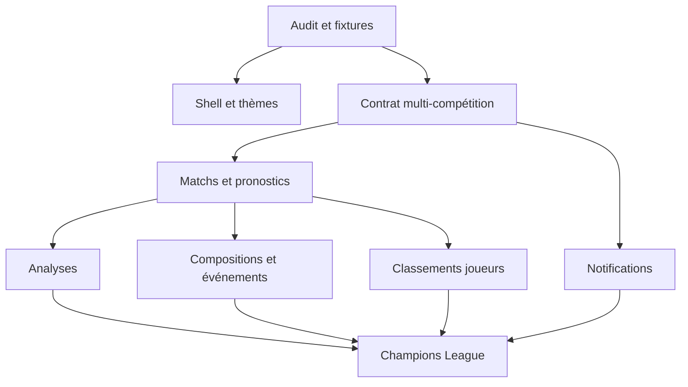

# Roadmap de migration et découpage des PR

## 1. Stratégie générale

Le programme avance verticalement : données + métier + API + UI + tests pour un
petit domaine cohérent. Les longues branches et les réécritures « big bang »
sont évitées.

Chaque lot produit :

- une fiche de mapping legacy/nouveau ;
- des fixtures anonymisées ;
- des tests de non-régression ;
- des écrans complets dans les deux thèmes ;
- la mise à jour des statuts de l'inventaire ;
- une procédure de déploiement et de retour arrière.

## 2. Ordre recommandé

### Lot 0 — Audit mesurable

**Objectif :** rendre la parité pilotable.

1. Générer le catalogue des endpoints/actions PHP.
2. Cartographier tables MySQL, collections Firestore et propriétaires métier.
3. Créer un registre machine-readable des capacités `PAR-*`.
4. Capturer les écrans de référence mobile/desktop, clair/sombre.
5. Constituer un petit jeu de données anonymisé couvrant tous les statuts.
6. Ajouter un tableau de couverture à la CI.

**Sortie :** aucun domaine n'est « probablement migré » ; chacun a un statut et
des preuves attendues.

### Lot 1 — Design system Player et shell fidèle

PR suggérées :

1. tokens sémantiques clair/sombre et préférence persistée ;
2. shell responsive, header à deux niveaux et navigation sticky ;
3. sélecteurs compétition/saison et contexte global ;
4. primitives de modale, panneau, onglets, badges, jauges et états réseau ;
5. gestion du retour Android et des piles de modales ;
6. PWA, splash, icône actuelle et écran de mise à jour.

**Dépendance :** aucune règle sportive majeure.
**Risque :** transformer ce lot en refonte esthétique. La capture historique
reste la référence d'ergonomie.

### Lot 2 — Contrat multi-compétition complet

PR suggérées :

1. modèle `CompetitionSeason`, `Stage`, `Round` et formats ;
2. chemins Firestore et règles d'accès par `competitionKey` ;
3. sélecteur de contexte partagé et URLs ;
4. adaptation des matchs/pronostics/classements existants ;
5. support des phases UEFA et matchs aller-retour ;
6. migration des documents Ligue 1 vers les clés canoniques.

**Sortie :** aucun callable Player ne dépend implicitement de `2026` ou de la
Ligue 1.

### Lot 3 — Carte de match et pronostic

PR suggérées :

1. read model complet d'une journée/phase ;
2. carte avant-match et saisie accessible ;
3. verrouillage serveur et visibilité des pronostics ;
4. carte terminée, score, verdict et décomposition des points ;
5. navigation de journée et vues programme/résultats/grille ;
6. correction idempotente d'un score et recalcul transactionnel.

**Sortie :** parité du cœur de jeu avant d'ajouter les analyses.

### Lot 4 — Match Center analytique

Chaque sous-domaine reste une PR ou une petite série :

1. conteneur Analyse, cache et états ;
2. H2H avec filtres Tous/Domicile/Extérieur ;
3. Forme et points de forme sur la carte ;
4. statistiques détaillées regroupées ;
5. Tendances, périodes, échantillons et enseignement ;
6. classement contextuel ;
7. actions « ouvrir tous » et optimisation des lectures.

**Entitlements :** le calcul sportif reste partagé ; la politique décide de la
profondeur visible selon l'offre.

### Lot 5 — Compositions, effectifs et faits de jeu

PR suggérées :

1. modèle normalisé joueurs/équipes/formations ;
2. synchronisation compositions et événements ;
3. terrain adaptatif et algorithme de placement ;
4. titulaires, notes, badges et entraîneurs ;
5. banc par poste et substitutions ;
6. timeline des faits de jeu ;
7. modale d'effectif complet et fallbacks ;
8. outils Admin de reprise/correction.

**Sortie :** comparaison visuelle sur plusieurs formations et tailles d'écran.

### Lot 6 — Classements et statistiques des joueurs

PR suggérées :

1. podium global et par journée ;
2. filtres communauté/compétition/saison ;
3. détails bonus/cotes et ex æquo ;
4. taux de réussite ;
5. évolution des rangs ;
6. évolution des points cumulés ;
7. résumé de statistiques du header.

### Lot 7 — Notifications et Telegram

PR suggérées :

1. schéma préférences/canaux/appareils et contrats métier ;
2. centre de préférences Player ;
3. migration Web Push et notification de test ;
4. bot Telegram, webhook sécurisé et parcours Chat ID ;
5. e-mail transactionnel et templates ;
6. outbox, déduplication, retries et journal de livraison ;
7. rappels de clôture et résultats ;
8. annonces multicanales depuis l'Admin ;
9. tableau de santé/délivrabilité.

**Ordre important :** préférences et outbox avant les campagnes automatiques.

### Lot 8 — Quiz et bonus à parité

PR suggérées :

1. résolution/scoring quiz ;
2. historique et détail ;
3. quiz spéciaux et chronométrés ;
4. classements quiz ;
5. génération et validation Admin ;
6. historique/détail des bonus ;
7. calcul automatique et outils Admin ;
8. notifications d'ouverture et d'échéance.

### Lot 9 — Championnat, clubs et statistiques sportives

PR suggérées :

1. classements général/domicile/extérieur ;
2. résultats, programme et phases ;
3. buteurs et passeurs ;
4. fiches clubs et calendriers ;
5. effectifs et identités multi-fournisseurs ;
6. support classement de phase UEFA.

### Lot 10 — FAQ, guide et nouveautés

PR suggérées :

1. contenu centralisé du règlement ;
2. FAQ courte et guide complet ;
3. légendes contextuelles ;
4. changelog et modal « nouveautés » ;
5. versionnement indépendant des trois applications.

### Lot 11 — Admin à parité opérationnelle

PR suggérées :

1. shell Admin et navigation ;
2. utilisateurs, rôles, accès et plans ;
3. compétitions/saisons/phases ;
4. console de synchronisation ;
5. corrections et recalculs ;
6. effectifs ;
7. quiz/bonus ;
8. annonces/notifications ;
9. audit, santé, quotas et erreurs ;
10. entraînement/simulation dans un environnement isolé.

### Lot 12 — Ouverture Champions League

1. audit réel de couverture des fournisseurs ;
2. création de la compétition et de la saison ;
3. import/synchronisation des clubs ;
4. phase de ligue, classement et calendrier ;
5. barrages et élimination directe ;
6. tests de pronostics, points, stats et communautés ;
7. seuils de publication Public ;
8. activation Player contrôlée ;
9. monitoring de la première journée ;
10. rétrospective avant Europa League.

Les lots suivants réutilisent ce pipeline pour Europa, Conference, Premier
League, Liga, Bundesliga et Serie A.

## 3. Dépendances critiques



Le quiz, le bonus, l'aide et plusieurs pans de l'Admin peuvent avancer après le
contrat multi-compétition sans attendre tout le Match Center.

## 4. Format d'une PR de parité

Chaque description de PR contient :

```text
Capacités : PAR-...
Source legacy : fichiers/actions PHP concernés
Collections : lectures et écritures
Entitlements : libre/gratuit/premium/admin
Variantes : compétition, phase, statut du match
UX : mobile/desktop + clair/sombre
Tests : unitaires/intégration/E2E/visuels
Migration : script, comptages, rollback
Observabilité : logs, métriques et alertes
Hors périmètre explicite : ...
```

## 5. Priorisation produit

### P0 — Le produit ne fonctionne pas correctement sans cela

- accès/auth ; contexte compétition/saison ;
- matchs, saisie et verrouillage ;
- scoring et classement ;
- données fiables ;
- shell mobile et thèmes ;
- isolation communautaire et limites serveur.

### P1 — Parité visible et valeur différenciante

- H2H, forme, stats et tendances ;
- compositions et faits de jeu ;
- notifications, dont Telegram ;
- quiz et bonus complets ;
- statistiques des parieurs ;
- Admin d'exploitation.

### P2 — Croissance et sophistication

- automatisations avancées ;
- expériences/A-B tests sur ces nouveaux modules ;
- personnalisation des alertes ;
- enrichissements premium ;
- extension aux autres compétitions après validation du pipeline UEFA.

P1 ne signifie pas facultatif : ces fonctions font partie de la parité cible.
La priorité sert uniquement à ordonner les livraisons.

## 6. Estimation par complexité

Les estimations ne sont pas des dates ; elles aident à dimensionner les PR.

| Domaine | Complexité | Risque principal |
| --- | --- | --- |
| Shell et thèmes | M | régression mobile |
| Multi-compétition | XL | hypothèses Ligue 1 cachées |
| Cœur pronostics | L | clôture et recalcul |
| H2H/Forme | M | requêtes et périmètre |
| Stats/Tendances | L | équivalence des calculs |
| Compositions | XL | placement et qualité fournisseur |
| Classements joueurs | L | agrégats et corrections |
| Notifications | XL | consentement et délivrabilité |
| Quiz/Bonus | L | états et scoring |
| Admin complet | XL | sécurité et opérations destructrices |
| Champions League | XL | phases et couverture API |

## 7. Jalons

- **Jalon A — Fondations de parité :** lots 0 à 3.
- **Jalon B — Player riche :** lots 4 à 6.
- **Jalon C — Engagement :** lots 7 à 10.
- **Jalon D — Exploitation autonome :** lot 11.
- **Jalon E — Première expansion :** lot 12.

Un jalon est validé par la recette, pas par le seul merge des PR.
